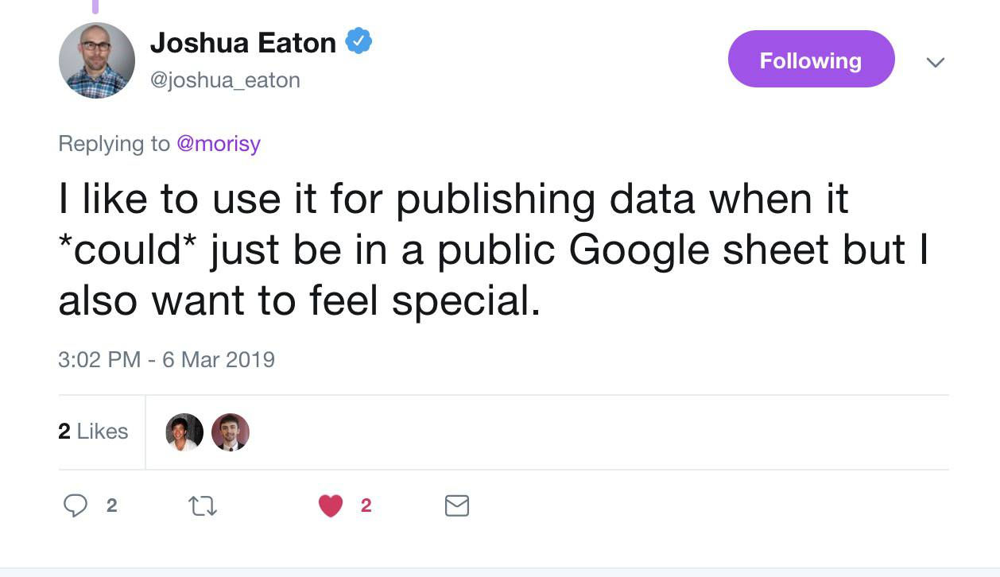

<!--ts-->
   * [What is Github](#what-is-github)
   * [Why Github](#why-github)
   * [How Journalists Use Github](#how-journalists-use-github)
      * [One-off Show-and-Tell: TheUpshot/leo-senate-model](#one-off-show-and-tell-theupshotleo-senate-model)
      * [fivethirtyeight/data](#fivethirtyeightdata)
   * [WaPo's data repo for "Fatal Force"](#wapos-data-repo-for-fatal-force)
   * [Example: Trying out an Amazon voice-to-text API on web video](#example-trying-out-an-amazon-voice-to-text-api-on-web-video)
   * [Useful references](#useful-references)

<!-- Added by: dan, at:  -->

<!--te-->

# What is Github

- Fun
- Really fun

---

# Why Github

Lorem ipsum dolor sit amet, consectetur adipisicing elit. Debitis minima at aliquid cum sunt corporis, alias, distinctio quo voluptas natus accusamus temporibus quasi velit officiis ipsum accusantium molestiae rerum reprehenderit.

---
# How Journalists Use Github

---
## One-off Show-and-Tell: TheUpshot/leo-senate-model

NYT Feature: [Who Will Win The Senate](http://web.archive.org/web/20140423110853/http://www.nytimes.com/newsgraphics/2014/senate-model/)

???

Original URL: 

Screenshot comes from Internet Archive snapshot:
http://web.archive.org/web/20140423110853/http://www.nytimes.com/newsgraphics/2014/senate-model/

---

The Github repo is here: 

https://github.com/TheUpshot/leo-senate-model

---
## fivethirtyeight/data

Data and code behind the articles and graphics at FiveThirtyEight https://data.fivethirtyeight.com/
https://www.theguardian.com/us-news/ng-interactive/2015/jun/01/the-counted-police-killings-us-database
# WaPo's data repo for "Fatal Force"

The story: https://www.washingtonpost.com/graphics/national/police-shootings-2016/

Notice the "Download the data" link; it goes to the following URL for a Github repo:

https://github.com/washingtonpost/data-police-shootings

???

This project by the wapo

---

The Github repo: 

img

???

Lorem ipsum dolor sit amet, consectetur adipisicing elit. Earum voluptas, aliquid, modi ipsum sunt quaerat alias placeat illum voluptatum deserunt iure laborum repudiandae perferendis corporis doloribus accusantium eligendi odit molestiae.

---
# Example: Trying out an Amazon voice-to-text API on web video

https://twitter.com/jiveDurkey/status/1103404819568607232
# Useful references

[GitHub Pages](https://lab.github.com/githubtraining/github-pages) - Learn how to use Github as a place to share files and even create static websites for portfolios and resumes. 

[Learn Git Branching](https://learngitbranching.js.org/) - An interactive exercise that lets you practice the `git branch` concept and see a visual diagram of how it works. 

---
