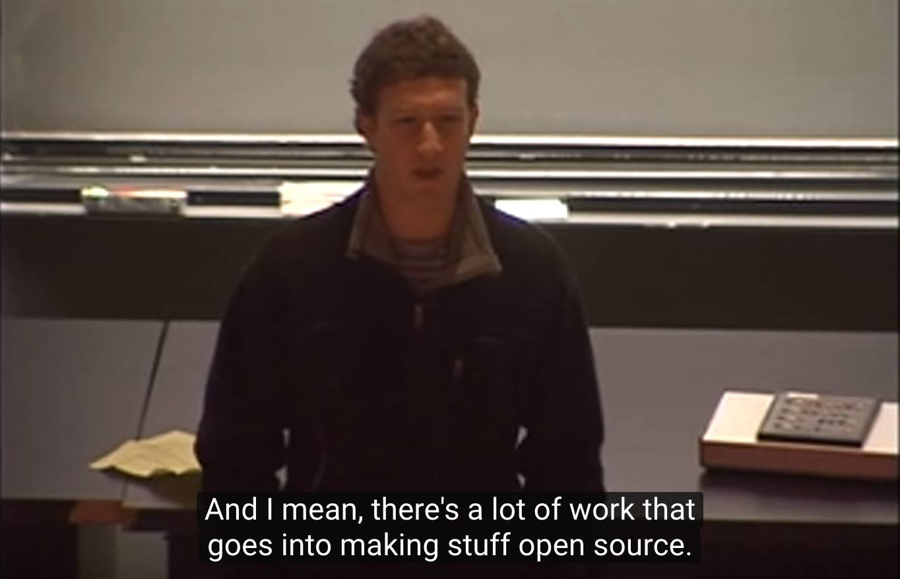

# Git and Github for Journalists

-----------

## Glossary

- **git** - "the stupid content tracker" Version control software, aka file management for tracking changes to files. Installed on computers, including your personal PC, and the Github server.

- **GitHub** - Social network for your files, the Instagram to git's "camera". Has likes, comments, cloning. Github uses git, while a git user is not necessarily a Github user.

- **repo** - A project folder. The basic unit of Github, what a post is to a blog, a photo to Instagram.

## Quick hello world

- You can use the Github website to build your repo.
- You can use command-line interface (add, commit)
- git push -- connects your local repo to the master repo
- [hello world tutorial](https://guides.github.com/activities/hello-world/)

## Helping yourself by helping others

[CS50 Lecture by Mark Zuckerberg (2005)](https://www.youtube.com/watch?v=xFFs9UgOAlE)

In 2005, Mark Zuckerberg (guest lecturing at Harvard's CS50), said FB wasn't open-sourcing its tools and didn't plan on doing so, because of the cost.

By 2015, FB had an open-source reputation as prominent as Google's, particularly its [reactjs library](https://en.wikipedia.org/wiki/React_(JavaScript_library)). In a [Changelog Interview, James Pearce, FB head of Open Source](https://changelog.com/podcast/211), explained how FB got into it, and the benefits they get from sharing their libraries. 

Besides improving Facebook's reputation as a software company, it was a way to train prospective employees. For example, their [reactjs library](https://reactjs.org/) was built in-house by Instagram and used to greatly speed up their web development. ReactJS was so popular when it was made open source that FB had created a pool of ReactJS experts who had never been in the company.

## Journalism's Software Dev

Every media company depends on tech, sometimes they have to make their own tools. While journalism is comfortable using the tools of the world -- e.g. the best spreadsheet for journalists is the same one for businesses and hedgefunds, the best photo editor, video recorder, etc -- tools created by journalists start out with that narrower audience, with a few breakouts:

(this also attracts non-journalist devs into journalism)

- [Django](https://docs.djangoproject.com/en/2.1/) - used for many data apps, like [CensusReporter](https://censusreporter.org/, while being the backbone of Instagram.
- [csvkit](https://github.com/wireservice/csvkit) - a command-line tool for comma-delimited data
- [ChartBuilder](https://github.com/Quartz/Chartbuilder) - Quartz's in-house quick-chart-making tool.
- [tabula](https://github.com/tabulapdf/tabula) - liberating data from PDFS, the scourge of document/data journalists

## Github Life

If you aren't a developer, don't make the mistake of thinking that Github is for making software. Github is for **files**, of any type of content, and of any scope. Start personal:

- NICAR schedule: https://github.com/ireapps/nicar-2019-schedule
- Palewire's datadesk reunion:
    - Github Pages: https://palewire.github.io/nicar19-datadesk-family-reunion/
    - https://github.com/palewire/nicar19-datadesk-family-reunion/ - note how this could've been done with a tweet, or something simpler. Welsh chose to use Github maybe because it's there, but also for quick editing/collaboration.
- Christine Zhang documenting her lesson for R data cleaning, for others to use and re-use: https://github.com/underthecurve/r-data-cleaning-tricks
- A one-off dataviz, based on a reaction to a current event: https://github.com/underthecurve/bourdain-travel-places

- Student account of Saurabh Datar (Stanford j-school alum, now at the Globe):
    - testing out ideas: https://github.com/ssdatar
    - publishing his portfolio with Github Pages: https://github.com/ssdatar/ssdatar.github.io
    - The [crime-in-india Github "organization"](https://github.com/crime-in-india) for his senior thesis, containing separate repos for the [web app](https://crime-in-india.github.io/), the raw data, and the data processing

## Check out our data

People who have never worked in a news org have very peculiar assumptions about how journalism is done. And many data science folks are blown away that journalists actually use data:

### Project data

- [VICE police shootings](https://news.vice.com/en_us/article/a3jjpa/nonfatal-police-shootings-data)
- [WaPo Fatal Force](https://github.com/washingtonpost/data-police-shootings)
- Compare how data is downloaded with:
    - [Fatal Encounters](https://www.fatalencounters.org/spreadsheets/), which uses Google Drive/Forms for crowdsourcing
    - [The Guardian Counted](https://www.theguardian.com/us-news/ng-interactive/2015/jun/01/the-counted-police-killings-us-database)

### Organization-wide stories and projects

- [fivethirtyeight/data](https://github.com/fivethirtyeight/data) is likely the most "starred" repo by a journalism org
- [buzzfeednews/everything](https://github.com/BuzzFeedNews/everything) is maybe the best example of how to use a Github repo to showcase work and data.
 

### Collaboration

- Congress bio info, including social media accounts, is a crowdsourced affair: https://github.com/unitedstates/congress-legislators
- OpenElections, many techniques/scripts/humans to deal with every kind of state/county precinct: https://github.com/openelections

### Content and stories

- BBC Data Unit: https://github.com/BBC-Data-Unit
- Bad data guide: https://github.com/Quartz/bad-data-guide
- Content can be lists; Max Woolf's big list of naughty strings: https://github.com/minimaxir/big-list-of-naughty-strings
- WHAT IS CODE BY PAUL FORD: https://www.bloomberg.com/graphics/2015-paul-ford-what-is-code/

### Case studies with the NYT:

NYT Feature: [Who Will Win The Senate](http://web.archive.org/web/20140423110853/http://www.nytimes.com/newsgraphics/2014/senate-model/)

- https://github.com/TheUpshot/leo-senate-model
- Check out the sparsity and nature of the commits: https://github.com/TheUpshot/leo-senate-model/commits/master

Sharing raw government data: [When the News Calls for Raw Data](https://source.opennews.org/articles/when-news-calls-raw-data/)

> Because the raw data was basically usable, and because I didn’t want to introduce errors, we published the Excel file exactly how we received it. It’s been great to see the stories that newsrooms have already written using it, and the attention that the release has received on Twitter and GitHub.

Example of reader factchecking the data: https://github.com/TheUpshot/Military-Surplus-Gear/issues/7

### Hands-on 

Best way to learn is to actually use Github, but you don't have to use it for "real" work

- Make a repo to stash data and instructions (e.g. a script command used)
- Make a list of interesting things, e.g. [awesome-git](https://github.com/dictcp/awesome-git)
- Make a pull request -- prose is fine
- Make a pull request to data, such as https://github.com/unitedstates/congress-legislators
- Clone a project and try it out: https://github.com/ireapps/first-news-app
