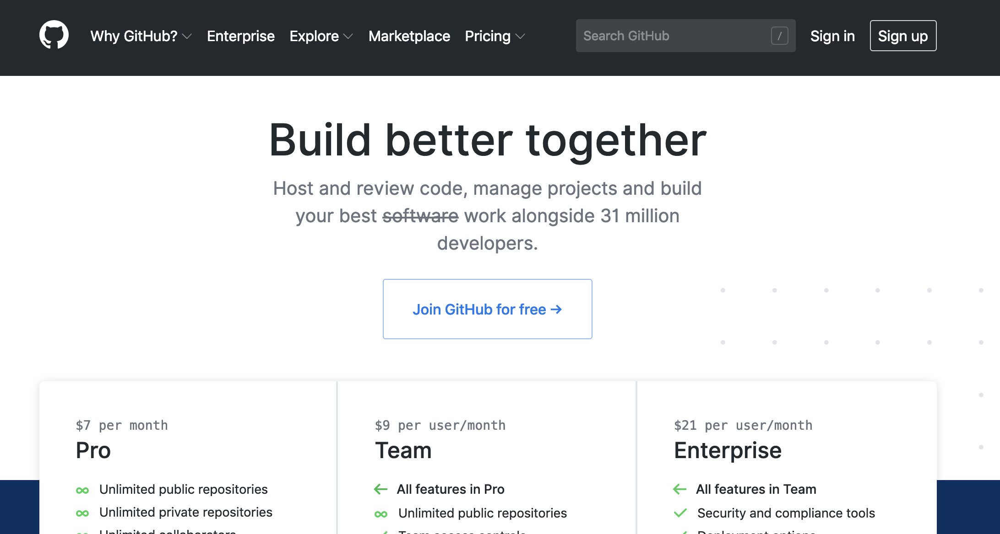

# Git and Github for Journalists

-----------

## Helping yourself and helping others

[CS50 Lecture by Mark Zuckerberg (2005)](https://www.youtube.com/watch?v=xFFs9UgOAlE)

In 2005, Mark Zuckerberg (guest lecturing at Harvard's CS50), said FB wasn't open-sourcing its tools and didn't plan on doing so, because of the cost.

By 2015, FB had an open-source reputation as prominent as Google's, particularly its [reactjs library](https://en.wikipedia.org/wiki/React_(JavaScript_library)). In a [Changelog Interview, James Pearce, FB head of Open Source](https://changelog.com/podcast/211), explained how FB got into it, and the benefits they get from sharing their libraries.

